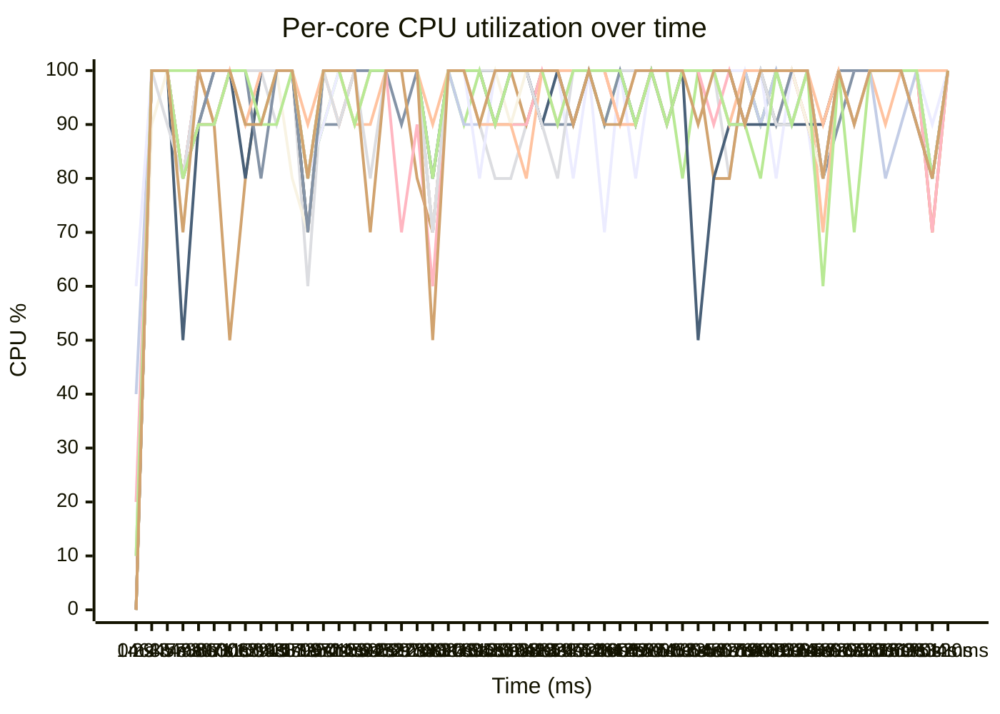

# Benchmark Results — Issue #82 Real Data

## Per-item cost breakdown

| Component | Time (ns) | Category |
|---|---|---|
| spawn_task | 4461.624555392139 | overhead |
| iter_advance | 73.00158471313419 | overhead |
| joinhandle_poll | 3287.0418826093683 | overhead |
| arc_clone | 20.21011080825105 | overhead |
| rwlock_read_compare | 8.32062724101292 | useful work |
| mutex_heap_peek_pop_push | 14.243488118219382 | useful work |
| compare_by_sum | 0.10380381519403693 | useful work |
| **overhead total** | **7841.87813352289254** | |
| **overhead fraction** | **99.7%** | |

## keep_first_n wall time

| Metric | Value |
|---|---|
| Wall time | 1217765681.2368255 ns |
| Effective cores | 14.13 |
| Throughput | 18261904 items/sec |

## Driver vs worker time split

| Metric | Value |
|---|---|
| driver_wall | 1.311 |
| worker_cpu | 21.538 |
| parallel_wall | 0.130 |

## Pipeline stage breakdown

| Stage | Time |
|---|---|
| pwr(3) on 8 items | 10535.53729965485 ns |
| combinations(3) on 512 items | 2358749810.1 ns |
| full pipeline | 4341730525.872222 ns |

## color-palette-picker end-to-end

| Benchmark | Time (ns) |
|---|---|
| bench_color_picker | 384393376.72 |
| range_8_pipeline | 1139689468.526091 |

## Full-scale projection

| Metric | Value |
|---|---|
| Benchmark items | 22238720 |
| Full-scale items | 463000000000000 |
| Projected wall time | 293.4 days (.8 years) |

## Per-core CPU utilization over time

<!-- cores: cpu0 cpu1 cpu10 cpu11 cpu12 cpu13 cpu14 cpu15 cpu2 cpu3 cpu4 cpu5 cpu6 cpu7 cpu8 cpu9 | samples: 53 of 575 -->
